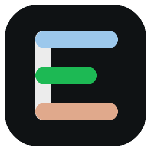
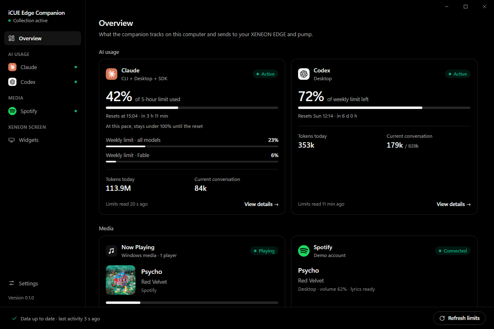
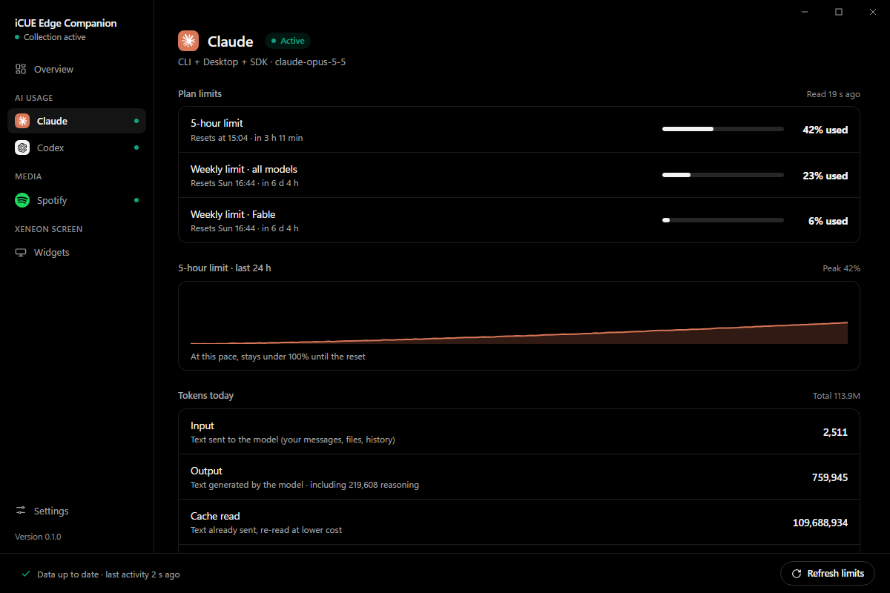
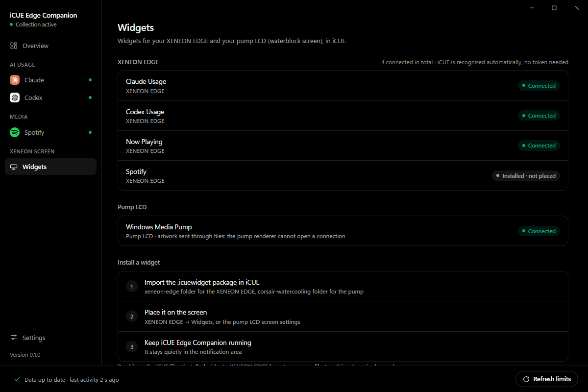
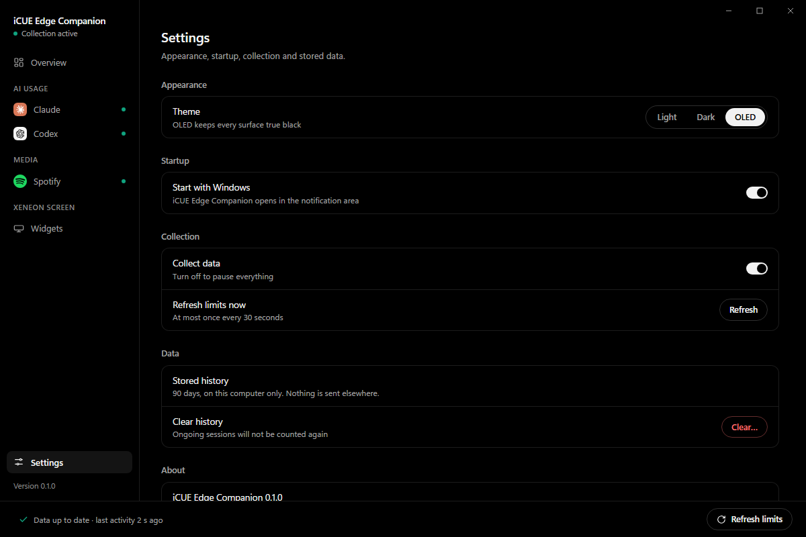

# iCUE Edge Companion



Windows tray application that feeds the CORSAIR XENEON EDGE iCUE widgets and shows the same data in its own window. Its first feature reads Claude and Codex usage on the local machine: token counts, context occupancy and subscription quotas, kept separate, each with its source and age. Its second feature reads the Windows media sessions (title, artwork, playback state, position) for the `Now Playing` widget. Its third feature connects to Spotify with your own Spotify app for the `Spotify` widget (artwork, controls, synced lyrics).

## Requirements

- Windows 10 or 11 with the WebView2 runtime (Tauri 2).
- Rust 1.95 or later to build (`companion/Cargo.toml`, edition 2021).
- Python 3 for `companion/icons/make_icon.py` and `scripts/latency-test.py`.
- iCUE 5.47 or later and the iCUE Widget CLI to package the widgets (`icue-edge-widgets/scripts/package-icuewidgets.ps1`).

## Install

```powershell
cd companion
cargo build --release
```

The executable is `companion\target\release\icue-edge-companion.exe`. Run it; an icon appears in the notification area.

To change the icon, edit `SHAPES` in `companion/icons/make_icon.py` and run it: it writes `icon.ico`, `icon.svg` and `icon-256.png`. Then delete `companion\target\release\build\icue-edge-companion-*` before building, otherwise Cargo keeps the old icon in the executable.

To produce an NSIS installer instead, run `cargo tauri build` from `companion` (requires `tauri-cli`, not installed by this repo). TODO: not verified.

## Usage

Left-click the tray icon to open the window; right-click it to open the tray card. The card closes as soon as it loses focus; closing the window destroys it and the companion keeps running in the tray.

Launching the executable again opens the window of the running instance; `icue-edge-companion.exe --tray` opens the tray card at the cursor instead.

Tray card: Claude and Codex summaries (closest limit, reset time, tokens today), then `Open dashboard`, `Refresh limits` (ignored if the last manual refresh is under 30 s old), `Pause collection`, `Quit`.

Window pages:

| Page | Content |
|---|---|
| `Overview` | AI usage (one card per provider: closest limit, other limits, tokens today, conversation size), Media (Now Playing with artwork and progress, Spotify connection and track), Screens (XENEON EDGE widgets connected, pump relay, local server), and a "How to read the AI figures" section. |
| `Claude` / `Codex` | All reported limits with reset times, token breakdown, conversation size, recent sessions, events, data sources. |
| `Widgets` | Each of our widgets on the XENEON EDGE and the pump LCD: installed, placed, connected. Read-only scan of iCUE's files (`CUE5\html_widgets`, `CUE5\dashlcd\storage` for the XENEON EDGE layout, `CUE5\profiles\*.cueprofiledata` for pump screens) plus the live streams per feed; installation steps. |
| `Settings` | Theme (`OLED`, default, true black; `Dark`; `Light`; remembered, also applied to the tray card), start with Windows (off by default, `HKCU\Software\Microsoft\Windows\CurrentVersion\Run` value `iCUE Edge Companion`), pause collection, refresh limits, clear usage history. |

Window with demo usage figures (the track is real):

| | |
| --- | --- |
| <br>`Overview` | <br>`Claude` |
| <br>`Widgets` | <br>`Settings` |

Claude limits are shown as the share used, with a 24 h chart of the headline limit (10-minute steps, gaps left empty) and an estimate of when it reaches 100% at the last hour's pace. Codex limits are shown as the share left, like the Codex app.

iCUE widgets `Claude Usage` and `Codex Usage` (source folders `icue-edge-widgets/widgets/xeneon-edge/claude-usage` and `icue-edge-widgets/widgets/xeneon-edge/codex-usage`):

1. Copy the shared views into the widget folders: `powershell -File scripts\sync-widgets.ps1`.
2. Package: `powershell -File ..\icue-edge-widgets\scripts\package-icuewidgets.ps1`.
3. Install the packages from `icue-edge-widgets/dist/icuewidgets/xeneon-edge/`. No setting is required: the companion recognises iCUE by the process that opens the connection.
4. Optional: style each widget in iCUE under `Widget Personalization` (`Background`, `Widget Transparency`, `Text Color`, `Accent Color`).

iCUE widget `Now Playing` (source folder `icue-edge-widgets/widgets/xeneon-edge/now-playing`, no sync step):

1. Package: `powershell -File ..\icue-edge-widgets\scripts\package-icuewidgets.ps1`.
2. Install `icue-edge-widgets/dist/icuewidgets/xeneon-edge/now-playing.icuewidget`.
3. Play something in an app that appears in the Windows media flyout. The widget shows its artwork, title, state, position and the controls the app accepts.
4. Tap the player name to pick a session or return to `Automatic`.

If you listen to Spotify, use the `Now Playing` widget: it reads the Windows media session, so it needs no Spotify app, stores no Spotify token and is not subject to Spotify's request limits. The `Spotify` widget below is for the queue (`Up next`) and device choice, and depends on the Spotify Web API.

iCUE widget `Spotify` (source folder `icue-edge-widgets/widgets/xeneon-edge/spotify`; advanced option: it needs your own Spotify app and Spotify Premium, while `Now Playing` works with any player and no account):

1. In the companion window, open `Media` › `Spotify` and follow the steps: create an app on `developer.spotify.com/dashboard`, add the redirect URI `http://127.0.0.1:47821/api/spotify/callback`, add your account under `User Management`, paste the Client ID, select `Connect` and approve in the browser.
2. Install `icue-edge-widgets/dist/icuewidgets/xeneon-edge/spotify.icuewidget`. Nothing is entered in iCUE.
3. `Disconnect` on the same page deletes the stored token.

iCUE widget `Windows Media Pump` (source folder `icue-edge-widgets/widgets/pump/windows-media-pump`, pump LCD, no touch): same media source as `Now Playing`, shown as full-screen artwork with the player, title, artist and a progress ring (round LCD) or bar. iCUE renders pump widgets in `QmlRenderer.exe`, which cannot reach the loopback server, so the companion also writes the snapshot and artwork into the installed widget folder (`%APPDATA%\Corsair\CUE5\html_widgets\com\stealthsrc\windowsmediapump\live\`, every 2 s, only when that widget is installed). Install `icue-edge-widgets/dist/icuewidgets/corsair-watercooling/windows-media-pump.icuewidget`. Preview: `icue-edge-widgets/previews/pump-media-preview/index.html`.

Without the companion, the `Now Playing` and `Windows Media Pump` widgets fall back after 8 s to the iCUE Media plugin: title and artist only, labelled `Native mode`. The simulated preview is `icue-edge-widgets/previews/media-player-preview/index.html`; it never reaches the companion.

## Architecture

- `companion/src/usage/`: the usage feature (Claude and Codex collectors, open apps from the process list in `apps.rs`, state, snapshot `ai-usage/1`). Later features get their own module next to it.
- `companion/src/media/`: the media feature. `gsmtc.rs` polls `GlobalSystemMediaTransportControlsSessionManager` every 500 ms; `mod.rs` keeps the state and builds snapshot `media/1` (session, shuffle and repeat, synced lyrics, system volume and sleep timer); `volume.rs` reads and sets the default output's volume and mute (Windows Core Audio); the snapshot also carries the Spotify queue (`queue`, from `spotify::queue_for`) when Spotify is the shown player and the queue belongs to the track on screen; `viz.rs` captures the default output (loopback), runs an FFT and streams 24 band levels; `run_lyrics` asks LRCLIB once per track for the session on screen (artist and a 30 s to 20 min length required). Each track gets a new revision `rev`; artwork is served only for the session and revision it was read for, and is withheld up to 3 s while it still matches the previous track's image.
- `companion/src/spotify/`: the Spotify feature. `auth.rs` runs the Authorization Code flow with PKCE (no client secret) and stores the refresh token encrypted with DPAPI in `%LOCALAPPDATA%\icue-edge-companion\spotify.json`; `api.rs` polls `/me/player`, fetches the artwork and LRCLIB lyrics for the current revision only, and runs widget commands from an allowlist (play/pause, next, previous, seek, shuffle, repeat, volume, transfer). It also reads the next 5 tracks (`/me/player/queue`, at each track change and every 30 s while playing) and their covers for `Up next`. Routes: `/api/spotify/state`, `events`, `art?r=<rev>`, `queue-art?i=<index>&q=<queue revision>`, `POST command`, and `callback`, the browser redirect, which only completes a sign-in started by the companion (single-use random `state`, 10 min).
- `companion/src/http.rs`: loopback server for the widgets on `127.0.0.1:47821`, routes under `/api/usage/`, `/api/media/` and `/api/spotify/` (`state`, `events`, `art?s=<session>&r=<rev>`, `POST command`, `POST select`, `viz`, the audio spectrum stream, opened only while a widget shows the visualiser). `POST command` also takes the computer-wide commands `volume`, `mute` and `sleep` (minutes, 0 cancels), which need no session. A `command` whose `rev` is not the current one gets `409` (except play/pause); an unsupported one gets `422`. A request is accepted when the client socket belongs to `iCUE.exe` under `%ProgramFiles%\Corsair\` (looked up in the Windows TCP table). Nothing else gets in: `Authorization: Bearer <token>` with the `widget_token` from `state.json` is refused unless the companion was started with `--allow-token` (done by `scripts/latency-test.py`), because any program of the same Windows account can read that file. Browsers get `401` whatever `Origin` they send.
- `companion/src/main.rs`: tray icon, tray card, window, Tauri commands (`usage_state`, `usage_refresh`, `app_info`, `set_paused`, `set_autostart`, `clear_history`, `open_main`, `open_link`, `quit_app`) and event `usage-state`. The pages never see the widget token and never use the HTTP server.
- `web/`: window (`index.html`, `app.js`), tray card (`tray.html`, `tray.js`) and widget (`widget.js`, `widget.css`), all built on `core.js`.

## Data sources

| Measure | Source | Read |
|---|---|---|
| Claude tokens, model, client, context estimate | `~/.claude/projects/**/*.jsonl`, `message.usage` of `assistant` lines | Incremental, 1 s for files changed in the last 10 min, 30 s otherwise |
| Claude quotas and extra usage | `GET https://api.anthropic.com/api/oauth/usage` with the token from `~/.claude/.credentials.json` (undocumented interface) | 60 s while active, 10 min idle, `Retry-After` on 429 |
| Codex tokens, model, client, context | `~/.codex/sessions/YYYY/MM/DD/rollout-*.jsonl`, `token_count` events | Incremental, same schedule |
| Codex quotas | `rate_limits` in the same events; `codex app-server` `account/rateLimits/read` only when no local value is under 5 min old | 60 s active, 15 min idle, exponential backoff |
| Spotify playback, devices, account, up next | Spotify Web API `/me/player`, `/me/player/devices`, `/me`, `/me/player/queue` (60 s) with your app's token | 3 s while playing, 5 s paused, 10 s idle; at most 20 calls per 30 s; `Retry-After` on 429, kept across restarts |
| Spotify lyrics | `lrclib.net/api/get`, then `lrclib.net/api/search` (duration within 5 s), synced lyrics only | Once per track, 64 tracks cached in memory |
| Media lyrics | `lrclib.net/api/get`, then `search`, synced lyrics only; title, artist, album and length of the track on screen, whatever the player | Once per track, 64 tracks cached in memory |
| Media volume, mute, shuffle, repeat | Windows Core Audio (default output) and the media session | 500 ms |
| Media title, state, position, controls, artwork | Windows `GlobalSystemMediaTransportControlsSessionManager` (sessions shown in the Windows media flyout) | 500 ms; thumbnail read on track change, then every 10 s |

Counting rules: `docs/COUNTING.md`.

## Configuration

| Variable | Default | Effect |
|---|---|---|
| `CLAUDE_CONFIG_DIR` | `%USERPROFILE%\.claude` | Claude directory (projects and credentials). |
| `CODEX_HOME` | `%USERPROFILE%\.codex` | Codex directory (sessions). |
| `LOCALAPPDATA` | system value | State is stored in `%LOCALAPPDATA%\icue-edge-companion\state.json`. A folder from an older name (`xeneon-edge-companion`, `ai-usage-monitor`) is moved there on first start. |
| `APPDATA` | system value | Used to locate `codex.exe` / `codex.cmd` under `npm`. |

The HTTP port is fixed at `47821` (`companion/src/http.rs`).

## Tests

```powershell
cd companion
cargo test --lib
python ..\scripts\latency-test.py
```

`latency-test.py` starts an isolated instance with `--allow-token` on fixture directories and prints the delay between a log write and its arrival on the widget stream. Quit any running companion first: the port and the single-instance lock are shared.

## Limitations

- Windows only (`codex app-server` lookup, `reg.exe`, `clip.exe`).
- The Claude quota endpoint and both log formats are internal interfaces; a client update can break them. Failures are shown as `Error` or `Check`, never as zero.
- Claude Desktop chat (outside Claude Code) writes no local token log: its tokens are not counted.
- Claude context capacity is not in the logs and is shown as unavailable.
- A file idle for more than 10 minutes is checked every 30 s, so the first event after a long pause can take up to 30 s to appear.
- Codex counts only growth over each session's high-water mark: a genuine counter reset inside one session is under-counted rather than double-counted.
- `Clear history` keeps offsets, deduplication keys and Codex session totals.
- The widgets pass the iCUE Widget CLI validation but have not yet been displayed on a XENEON EDGE.
- Media: only apps that publish a Windows media session are seen. Each app decides which fields and controls it publishes; browsers often publish a small video thumbnail and no previous/next.
- Media: artwork is limited to PNG, JPEG, GIF, BMP and WebP up to 4 MiB. No artwork is looked up online.
- Media: audio and video are never streamed or stored. The visualiser listens to the default output on this computer only while it is on screen, reduces it to 24 numbers, and sends just those to the widget over the loopback connection; nothing is recorded and nothing leaves the computer.
- Media: synced lyrics send the title, artist, album and length of what plays, in any player, to LRCLIB (a third-party service). There is no switch to turn this off yet.
- Spotify: playback control needs Spotify Premium, for the user and for the owner of the Spotify app. An app in development mode accepts up to 5 accounts listed under `User Management`. Since February 2026 Spotify no longer returns the subscription type to new development-mode apps, so Premium is only detected when Spotify refuses a command with `PREMIUM_REQUIRED`.
- Spotify: the Web API limits the requests of each app. The companion sends at most 20 per 30 s; when Spotify answers `429` it sends nothing until the wait ends (up to 24 h), and keeps that end time in `spotify-ban.txt` in its data folder across restarts. The widget shows `Spotify is busy` with the time left.
- Spotify: lyrics come from LRCLIB, a community database; many tracks have no synced lyrics. Lyrics in scripts outside Latin use a system font.
- Spotify: the sign-in and the widget have not yet been tested against a real Spotify account.

## License

MIT. Collection code adapted from `codex-rpc` and `claude-rpc` (MIT, © Inerthel). Claude and OpenAI marks in `web/core.js` come from Simple Icons (CC0); the brands belong to their owners.
